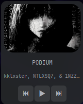

Minimal music widget for **EWW** with album cover, title, artist and media controls.



## ✨ Features
- Cover art (cached)
- Track title + artist
- Play / Pause / Next / Previous
- Lightweight and fast

## 📦 Dependencies
```bash
sudo pacman -S eww playerctl curl ttf-jetbrains-mono-nerd
```

## ▶ Usage
```
eww reload
eww open music
```

## 🧪 Tested on
- Arch Linux
- bspwm
- Spotify, Firefox, VLC

[](https://star-history.com/#happy1063/eww-music-widget&Date)
